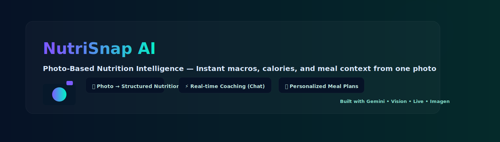

🥗 NutriSnap AI — Photo-Based Nutrition Intelligence

NutriSnap AI is a multimodal nutrition assistant that turns a single meal photo into a complete nutritional breakdown. It identifies food items, estimates portions, calculates calories and macros, and helps users manage daily goals — all inside an elegant React + Gemini-powered interface.

This project was born from a simple personal struggle:
I couldn’t track what I ate consistently.
Portion guesswork and missed entries made my progress unreliable. NutriSnap AI removes that friction.

## Key Features

- 📸 **Photo-Based Meal Logging** — Upload a single meal photo; NutriSnap detects items, estimates portions, and returns calories and macros in seconds.
- 🧠 **Multimodal AI Analysis** — Gemini Pro Vision + validation models provide bounding boxes, item confidence scores, and structured nutrition outputs.
- ⚡ **Instant Coaching (Chat)** — Context-aware Gemini Live assistant that explains logs, recommends swaps, and suggests goal-aligned meals.
- 📊 **Daily Tracker & Insights** — Per-meal logs, rolling totals, remaining goals, and weekly trend reports saved locally for quick access.
- 🍽️ **Personalized Meal Plans** — Generate goal-oriented meal plans using preferences and the Mifflin–St Jeor baseline.
- 🔁 **Text Input & Alternate Logging** — Describe a meal in plain text for quick logging when photos aren’t available.
- 💾 **Local Persistence** — `localStorage` for logs, water intake, saved recipes, and meal preferences (easy to migrate to cloud later).

🚀 Core Features walk-through:- 
📸 1. Photo-Based Meal Analysis

Upload a meal photo and instantly receive:

Food item detection with bounding boxes

Calorie and macronutrient estimation

Portion size interpretation

Healthier alternatives

Auto-logging into daily history

Powered by Google Gemini Pro Vision + custom processing logic.

🔍 2. Text-Based Analysis

Don’t have a photo?
Type a description.
NutriSnap will parse it and build a structured nutrition summary.

📊 3. Real-Time Daily Tracker

Track everything in one view:

Total calories, protein, carbs, fats

Remaining daily goals

Meal-wise logs with edit/delete options

Water intake logging

Preset or custom daily nutrient goals

All logs persist locally using localStorage.

🗣️ 4. Chat-Based Nutrition Assistant (Gemini Live)

Built-in conversational assistant that can:

Explain your logged meals

Suggest recipes

Recommend goal-specific meal ideas

Answer nutrition questions

Chat with real-time context from your food log

🍽️ 5. Meal Plan Generator

Choose your preferences.
NutriSnap creates a personalized meal plan aligned with your daily goals.

📚 6. Explore and Save Recipes

Discover AI-generated recipes with:

Nutrition context

Personalized recommendations

Ability to save, unsave, and revisit

📅 7. Deep Analysis + Weekly Report

Breakdowns include:

Average caloric intake

Macro consistency

Trends across the week

Habit insights

Visual summaries

🧠 Tech Stack
AI Models

Gemini Pro (Multimodal) – image, text, structured response parsing

Gemini Pro Vision – bounding box extraction and food identification

Gemini Live API – real-time conversational assistant

Optional: HuggingFace models (for cross-validation, depending on your workflow)

Frontend

React 19

TypeScript

Vite

TailwindCSS

Custom UI components & animations

Persistence

Browser localStorage for:

Food logs

Water logs

Diet mode

Custom nutrition goals

Saved recipes

Meal plan preferences

Build Tools

Vite

TypeScript

React Strict Mode

🏗️ Project Structure Overview
NutriSnap/
│
├── App.tsx                   # Main app container and routing logic
├── index.tsx                 # Entry point
├── index.html                # Root HTML with import maps & theme
├── /components               # UI components (Uploader, Tracker, Modals, Chat, Pages)
├── /services                 # Gemini API services, sound engine
├── /types                    # Shared TypeScript type definitions
├── /pages                    # Deep Analysis, Meal Plan, Explore, Saved Recipes
├── package.json              # Dependencies
├── tsconfig.json             # TS config
└── README.md                 # Project documentation

📦 Installation & Setup
Prerequisites

Node.js 18+

1. Clone the repository
git clone https://github.com/Hemkumar247/NutriSnap.git
cd NutriSnap

2. Install dependencies
npm install

3. Add your Gemini API key

Create a .env.local file:

GEMINI_API_KEY=your_api_key_here

4. Run the development server
npm run dev

Your app will be available at:

http://localhost:5173/

🎯 How It Works
Meal Detection Pipeline

User uploads a meal photo

App sends image → Gemini Vision

AI returns:

Detected food items

Bounding boxes

Calorie + macro estimates

App displays visual overlays and structured data

User logs meal → Added to daily log

Text Mode Pipeline

User types a description (ex: “2 rotis, paneer curry, 1 cup curd”)

Text is parsed → structured nutrition

Displayed and logged

Chat Mode

Gemini Live API responds with contextual answers using:

Your daily goals

Your logged meals

Your nutrition history

Your water intake

Your saved recipes

🔮 Future Enhancements

User accounts and cloud sync

Macro-specific goal suggestions

Wearable integration

Social challenges

Meal reminders

AI-generated grocery lists

🤝 Contributing

Pull requests are welcome!
Report bugs or request features in the Issues tab.

🧑‍💻 Author

Hem Kumar

AI + Full-Stack Developer
Focused on building real-world AI tools that reduce friction in everyday life.

⭐ Support the Project

If NutriSnap AI helped or inspired you, consider leaving a star ⭐ on the repository.
